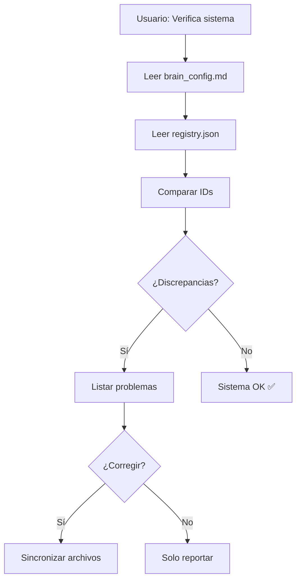

# 🔗 System Coordinator Skill

Skill maestra que mantiene la coherencia e integridad de todo el ecosistema Brain OS.

---

## When to Use This Skill

Trigger cuando el usuario o el sistema necesite:
- Verificar correlación entre componentes del sistema
- Sincronizar IDs entre Notion, NotebookLM y Brain OS
- Agregar un nuevo curso o área al sistema
- Verificar integridad después de cambios
- Diagnosticar problemas de conexión entre componentes

### Frases Trigger
- "Verifica el sistema"
- "Sincroniza todo"
- "Agrega [curso] al sistema"
- "¿Está todo conectado?"
- "Diagnóstico del sistema"

---

## Arquitectura del Sistema Brain OS

```
┌─────────────────────────────────────────────────────────────┐
│                      BRAIN OS CORE                          │
│  ┌──────────────┐  ┌──────────────┐  ┌──────────────┐      │
│  │ brain_config │  │   INICIO     │  │  workflow    │      │
│  │    .md       │  │    .md       │  │  study.md    │      │
│  └──────┬───────┘  └──────┬───────┘  └──────┬───────┘      │
│         │                 │                 │               │
│         └────────────┬────┴─────────────────┘               │
│                      │                                      │
│              ┌───────▼───────┐                              │
│              │   REGISTRIES   │                              │
│              │ ┌─────────────┐│                              │
│              │ │notebooklm   ││                              │
│              │ │_registry.json│                              │
│              │ └─────────────┘│                              │
│              └───────┬───────┘                              │
└──────────────────────┼──────────────────────────────────────┘
                       │
       ┌───────────────┼───────────────┐
       │               │               │
┌──────▼─────┐  ┌──────▼─────┐  ┌──────▼─────┐
│   Notion   │  │ NotebookLM │  │Aula Virtual│
│  BD_AREAS  │  │ 7 notebooks│  │  Moodle    │
└────────────┘  └────────────┘  └────────────┘
```

---

## Archivos Clave del Sistema

| Archivo | Propósito | Verificar |
|---------|-----------|-----------|
| `brain_config.md` | IDs de Notion, NotebookLM, Aula Virtual | IDs válidos |
| `INICIO.md` | Dashboard, comandos, estado | Links funcionales |
| `config/notebooklm_registry.json` | Mapeo cursos ↔ notebooks | Sincronizado con brain_config |
| `.agent/workflows/brain-os-study.md` | Workflow principal | Comandos actualizados |
| `skills/notebooklm/SKILL.md` | Skill NotebookLM | Flujo B+C documentado |

---

## Comandos Disponibles

### 1. Verificar Integridad del Sistema

Cuando usuario dice: **"Verifica el sistema"** o **"Diagnóstico"**

Ejecutar:
1. Leer `brain_config.md` → Extraer IDs
2. Leer `config/notebooklm_registry.json` → Comparar notebooks
3. Verificar que cada curso tenga:
   - [ ] ID de Notion en brain_config.md
   - [ ] Entrada en notebooklm_registry.json
   - [ ] Comando en INICIO.md
   - [ ] Carpeta en `carrera/semestres/[SEMESTRE]/cursos/`
4. Reportar discrepancias

### 2. Agregar Nuevo Curso al Sistema

Cuando usuario dice: **"Agrega [curso] al sistema"**

Ejecutar:
1. Pedir información:
   - Nombre del curso
   - ID de Notion (si existe)
   - URL de NotebookLM (si existe)
   - Tipo: universitario | personal
2. Actualizar:
   - `brain_config.md` → Agregar IDs
   - `config/notebooklm_registry.json` → Agregar entrada
   - `INICIO.md` → Agregar comando
   - `.agent/workflows/brain-os-study.md` → Agregar a tabla
3. Crear carpeta del curso si no existe

### 3. Sincronizar Registries

Cuando usuario dice: **"Sincroniza todo"**

Ejecutar:
1. Leer brain_config.md como fuente de verdad
2. Actualizar notebooklm_registry.json para coincidir
3. Verificar INICIO.md tiene todos los comandos
4. Reportar cambios realizados

---

## Checklist de Verificación

### Para cada curso, verificar:

```yaml
Curso: [Nombre]
  - [ ] brain_config.md tiene ID de Notion
  - [ ] brain_config.md tiene ID de NotebookLM
  - [ ] notebooklm_registry.json tiene entrada
  - [ ] INICIO.md tiene comando
  - [ ] workflow tiene entrada en tabla
  - [ ] Carpeta existe en carrera/semestres/
```

---

## Flujo de Ejecución



---

## Estructura de Datos

### brain_config.md (Fuente de verdad)
```yaml
CURSO_[NOMBRE]:
  notion_id: "uuid"
  notebook_id: "slug"
  notebook_url: "https://..."
  aula_virtual_patterns: ["PATTERN1", "PATTERN2"]
```

### notebooklm_registry.json
```json
{
  "notebooks": [
    {
      "id": "slug",
      "name": "Nombre",
      "curso_path": "carrera/...",
      "notion_id": "uuid",
      "url": "https://...",
      "status": "active|pending"
    }
  ],
  "mapping": {
    "curso_id": "notebook_id"
  }
}
```

---

## Troubleshooting

| Problema | Causa | Solución |
|----------|-------|----------|
| "Curso no encontrado en registry" | Falta sincronización | Ejecutar "Sincroniza todo" |
| "ID de Notion inválido" | UUID incorrecto | Verificar en brain_config.md |
| "NotebookLM no responde" | Skill no autenticada | Ejecutar auth setup |
| "Carpeta de curso no existe" | Curso nuevo | Crear estructura con template |

---

## Dependencias

- `skills/notebooklm/` → Para consultas a notebooks
- `brain_config.md` → Fuente de verdad de IDs
- `config/notebooklm_registry.json` → Mapeo de notebooks
- MCP Notion Server → Para validar IDs de Notion
