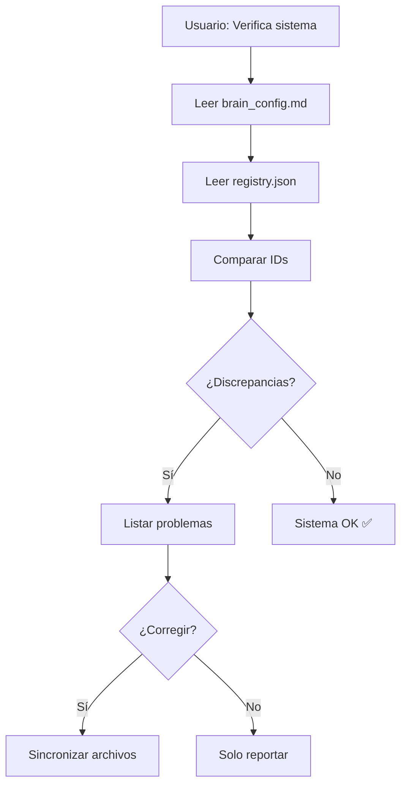

# 🔗 System Coordinator Skill

Skill maestra que mantiene la coherencia e integridad de todo el ecosistema Brain OS.

---

## When to Use This Skill

Trigger cuando el usuario o el sistema necesite:
- Verificar correlación entre componentes del sistema
- Sincronizar IDs entre Notion, NotebookLM y Brain OS
- Agregar un nuevo curso, herramienta o skill al sistema
- Verificar integridad después de cambios
- Diagnosticar problemas de conexión entre componentes

### Frases Trigger
- "Verifica el sistema"
- "Sincroniza todo"
- "Agrega [curso] al sistema"
- "¿Está todo conectado?"
- "Diagnóstico del sistema"

---

## 🔄 AUTO-ACTUALIZACIÓN

> **Este skill se actualiza a sí mismo** cuando detecta cambios en el sistema.

### Qué se auto-actualiza:
1. **Diagrama de arquitectura** → Refleja nuevas herramientas/conexiones
2. **Lista de archivos obligatorios** → Incluye nuevos archivos críticos
3. **Conteo de skills** → Actualiza el número actual
4. **Herramientas en arquitectura** → Añade nuevas tools/

### Cuándo se auto-actualiza:
- Al ejecutar "Verifica el sistema" → Detecta componentes nuevos
- Al ejecutar "Sincroniza todo" → Actualiza este archivo también
- Al agregar nueva herramienta → Se incluye en arquitectura
- Al agregar nueva skill → Se actualiza conteo

### Cómo se auto-actualiza:
```yaml
1. Escanear tools/ → Detectar nuevas herramientas
2. Escanear skills/ → Contar skills actuales
3. Leer brain_config.md → Detectar nuevas integraciones
4. Comparar con este archivo
5. Si hay diferencias → Actualizar:
   - Diagrama de arquitectura
   - Lista de archivos
   - Número de skills
   - Herramientas mencionadas
6. Registrar fecha de última auto-actualización
```

### Última Auto-Actualización
- **Fecha**: 2026-02-09 00:30
- **Skills**: 30 (documentado como 30+)
- **Herramientas**: pomodoro/
- **Integraciones**: Notion, NotebookLM, Aula Virtual, Pomodoro Timer
- **Estado**: ✅ Sistema sincronizado

---

## Arquitectura del Sistema Brain OS

```
┌─────────────────────────────────────────────────────────────┐
│                      BRAIN OS CORE                          │
│  ┌──────────────┐  ┌──────────────┐  ┌──────────────┐      │
│  │ brain_config │  │   INICIO     │  │  workflow    │      │
│  │    .md       │  │    .md       │  │  study.md    │      │
│  └──────┬───────┘  └──────┬───────┘  └──────┬───────┘      │
│         │                 │                 │               │
│         └────────────┬────┴─────────────────┘               │
│                      │                                      │
│      ┌───────────────┼───────────────┐                      │
│      │               │               │                      │
│ ┌────▼────┐   ┌──────▼───────┐   ┌───▼───┐                 │
│ │REGISTRIES│   │   TOOLS      │   │SKILLS │                 │
│ │notebooklm│   │🍅 pomodoro/  │   │ 30+   │                 │
│ │_registry │   │  timer.py    │   │       │                 │
│ └────┬────┘   └──────┬───────┘   └───┬───┘                 │
└──────┼───────────────┼───────────────┼──────────────────────┘
       │               │               │
       ▼               ▼               ▼
┌──────────┐  ┌──────────────┐  ┌──────────┐
│  Notion  │  │ Pomodoro     │  │NotebookLM│
│ BD_AREAS │  │ state/history│  │ 7 books  │
└──────────┘  └──────────────┘  └──────────┘
```

---

## ⚠️ ARCHIVOS OBLIGATORIOS A SINCRONIZAR

> **CRÍTICO**: Cuando se hace CUALQUIER cambio al sistema, TODOS estos archivos deben verificarse y actualizarse.

### Nivel 1: Siempre Actualizar
| Archivo | Propósito | Qué sincronizar |
|---------|-----------|-----------------|
| `README.md` | Documentación pública | Estructura, integraciones, skills, comandos |
| `INICIO.md` | Dashboard principal | Comandos, diagrama, integraciones, estado |
| `brain_config.md` | Fuente de verdad | IDs, configs, herramientas |

### Nivel 2: Según Cambio
| Archivo | Propósito | Actualizar cuando... |
|---------|-----------|----------------------|
| `.agent/workflows/brain-os-study.md` | Workflow estudio | Nuevos comandos, modos, algoritmos |
| `config/notebooklm_registry.json` | Mapeo NotebookLM | Nuevo curso, nuevo notebook |
| `carrera/README.md` | Resumen carrera | Nuevo semestre, nuevo curso |

### Nivel 3: Herramientas
| Archivo | Propósito | Actualizar cuando... |
|---------|-----------|----------------------|
| `tools/pomodoro/config.json` | Config timer | Nuevos modos, reglas |
| `skills/pomodoro/SKILL.md` | Skill timer | Nuevos comandos |
| `skills/system-coordinator/SKILL.md` | Este archivo | Nueva herramienta o integración |

### Checklist de Sincronización
```yaml
Al agregar NUEVA HERRAMIENTA:
  - [ ] README.md → Estructura + Integraciones
  - [ ] INICIO.md → Comandos + Diagrama + Tabla integraciones
  - [ ] brain_config.md → Configuración
  - [ ] brain-os-study.md → Comandos del workflow
  - [ ] system-coordinator/SKILL.md → Arquitectura

Al agregar NUEVO CURSO:
  - [ ] brain_config.md → IDs Notion/NotebookLM
  - [ ] notebooklm_registry.json → Entrada del notebook
  - [ ] INICIO.md → Comando de consulta
  - [ ] brain-os-study.md → Tabla de cursos
  - [ ] carrera/README.md → Resumen
  - [ ] README.md → Número de cursos

Al cambiar SKILLS:
  - [ ] README.md → Número y categorías
  - [ ] INICIO.md → Tabla de skills
```

---

## Comandos Disponibles

### 1. Verificar Integridad del Sistema

Cuando usuario dice: **"Verifica el sistema"** o **"Diagnóstico"**

Ejecutar:
1. Leer **TODOS** los archivos Nivel 1:
   - `README.md` → Verificar estructura, skills, integraciones
   - `INICIO.md` → Verificar comandos, diagrama, tabla
   - `brain_config.md` → Extraer IDs como fuente de verdad
2. Leer archivos Nivel 2:
   - `config/notebooklm_registry.json` → Comparar notebooks
   - `.agent/workflows/brain-os-study.md` → Verificar comandos
   - `carrera/README.md` → Verificar cursos
3. Verificar que cada curso tenga:
   - [ ] ID de Notion en brain_config.md
   - [ ] Entrada en notebooklm_registry.json
   - [ ] Comando en INICIO.md
   - [ ] Entrada en README.md
   - [ ] Carpeta en `carrera/semestres/[SEMESTRE]/cursos/`
4. Verificar herramientas:
   - [ ] Pomodoro Timer: mencionado en README, INICIO, brain_config
   - [ ] Skills: número correcto en README e INICIO
5. **Reportar TODAS las discrepancias y corregir inmediatamente**

### 2. Agregar Nuevo Curso al Sistema

Cuando usuario dice: **"Agrega [curso] al sistema"**

Ejecutar:
1. Pedir información:
   - Nombre del curso
   - ID de Notion (si existe)
   - URL de NotebookLM (si existe)
   - Tipo: universitario | personal
2. **Actualizar TODOS estos archivos (obligatorio)**:
   - `README.md` → Actualizar número de cursos
   - `INICIO.md` → Agregar comando de consulta
   - `brain_config.md` → Agregar IDs
   - `config/notebooklm_registry.json` → Agregar entrada
   - `.agent/workflows/brain-os-study.md` → Agregar a tabla
   - `carrera/README.md` → Actualizar resumen
3. Crear carpeta del curso si no existe

### 3. Sincronizar Registries

Cuando usuario dice: **"Sincroniza todo"**

Ejecutar:
1. Leer brain_config.md como fuente de verdad
2. **Actualizar TODOS los archivos Nivel 1**:
   - README.md → Sincronizar estructura, skills, integraciones
   - INICIO.md → Sincronizar comandos, diagrama
3. Actualizar archivos Nivel 2:
   - notebooklm_registry.json para coincidir
   - brain-os-study.md para coincidir
4. **Auto-actualizar este skill** (ver sección 🔄 AUTO-ACTUALIZACIÓN)
5. Reportar cambios realizados

### 4. Auto-Actualizar Este Skill

Cuando usuario dice: **"Actualiza el coordinador"** o se ejecuta automáticamente

Ejecutar:
1. **Escanear sistema actual**:
   ```powershell
   # Contar skills
   ls skills/ | measure
   
   # Listar herramientas
   ls tools/
   
   # Verificar integraciones en brain_config.md
   ```
2. **Comparar con valores actuales en este archivo**:
   - Número de skills (actualmente: 30+)
   - Herramientas (actualmente: pomodoro/)
   - Integraciones (actualmente: 4)
3. **Si hay diferencias, actualizar**:
   - Diagrama de arquitectura
   - Sección "Última Auto-Actualización"
   - Lista de archivos obligatorios
4. **Registrar timestamp de actualización**

---

## Checklist de Verificación

### Para cada curso, verificar:

```yaml
Curso: [Nombre]
  - [ ] brain_config.md tiene ID de Notion
  - [ ] brain_config.md tiene ID de NotebookLM
  - [ ] notebooklm_registry.json tiene entrada
  - [ ] INICIO.md tiene comando
  - [ ] workflow tiene entrada en tabla
  - [ ] Carpeta existe en carrera/semestres/
```

---

## Flujo de Ejecución



---

## Estructura de Datos

### brain_config.md (Fuente de verdad)
```yaml
CURSO_[NOMBRE]:
  notion_id: "uuid"
  notebook_id: "slug"
  notebook_url: "https://..."
  aula_virtual_patterns: ["PATTERN1", "PATTERN2"]
```

### notebooklm_registry.json
```json
{
  "notebooks": [
    {
      "id": "slug",
      "name": "Nombre",
      "curso_path": "carrera/...",
      "notion_id": "uuid",
      "url": "https://...",
      "status": "active|pending"
    }
  ],
  "mapping": {
    "curso_id": "notebook_id"
  }
}
```

---

## Troubleshooting

| Problema | Causa | Solución |
|----------|-------|----------|
| "Curso no encontrado en registry" | Falta sincronización | Ejecutar "Sincroniza todo" |
| "ID de Notion inválido" | UUID incorrecto | Verificar en brain_config.md |
| "NotebookLM no responde" | Skill no autenticada | Ejecutar auth setup |
| "Carpeta de curso no existe" | Curso nuevo | Crear estructura con template |

---

## Dependencias

- `skills/notebooklm/` → Para consultas a notebooks
- `brain_config.md` → Fuente de verdad de IDs
- `config/notebooklm_registry.json` → Mapeo de notebooks
- MCP Notion Server → Para validar IDs de Notion
